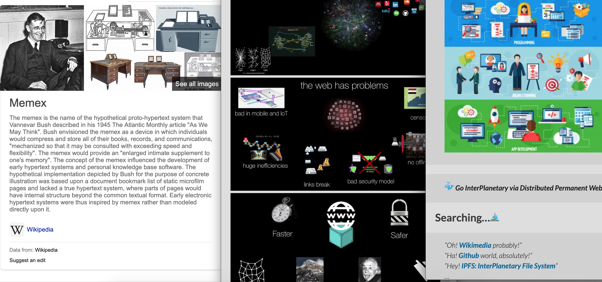

# [memex](https://web.mit.edu/STS.035/www/PDFs/think.pdf)

> "Consider a future device for individual use, and which is a sort of mechanized file and library. It needs a name, and to coin one at random, "memex" will do. A memex is a device in which an individual stores all his books, records and communications, and which is mechanized so that it can be consulted with exceeding speed and flexibility. It is an enlarged intimate supplement to his memory."

> :eyes:
- [Memex World](https://memex.world/)
- [Building a Memex](https://hyfen.net/memex/) by [Andrew Louis](https://github.com/hyfen)
- [DARPA Memex Catalog](https://www.darpa.mil/opencatalog?ocSearch=memex&sort=title&ocFilter=software)

# [distributed](https://github.com/ipfs/roadmap#-personal-web-d3-e4-i2)
> Personal data and programs are under user control

> "The memex becomes reality. The web becomes a drastically more personal thing. Users' data and exploration is under the users' control -- similar to how a "personal computer" is under the user's control, and "the cloud" is not. Users decide which apps and other people get access to their data. Explorations can be recorded for the user in memex fashion. The user gets to keep copies of all the data they have observed through the web. A self-archiving personal record forms, which the user can always go back to, explore, and use -- whether or not those applications are still in development by their authors."

# [sns](https://github.com/snspace/sns)

> __"Computing is not {only} about computers anymore. It is {also} about living."__   
> -- Nicholas Negroponte, Being Digital, 1995

> __"SNS would, should and ought to be something as _personal global infrastructure_, a solid foundation and great companion to _digital global nomads_."__

---

